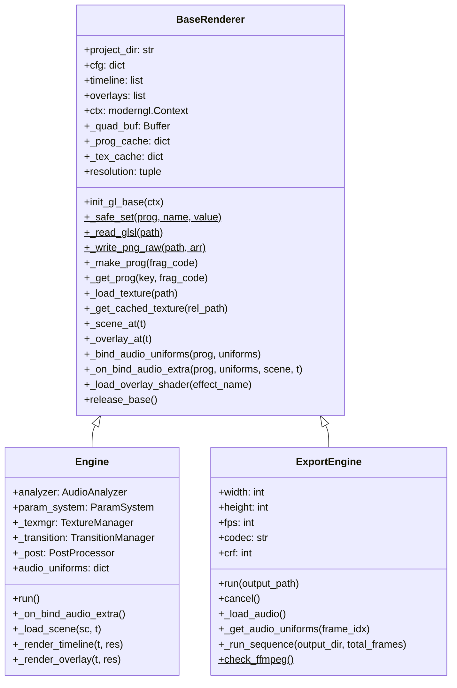
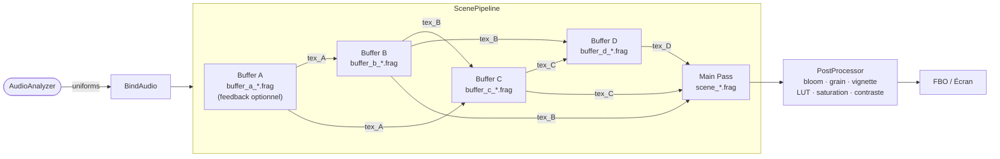
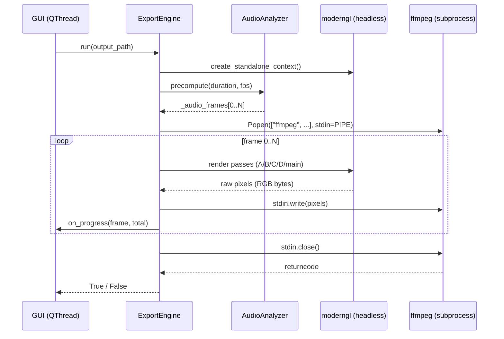
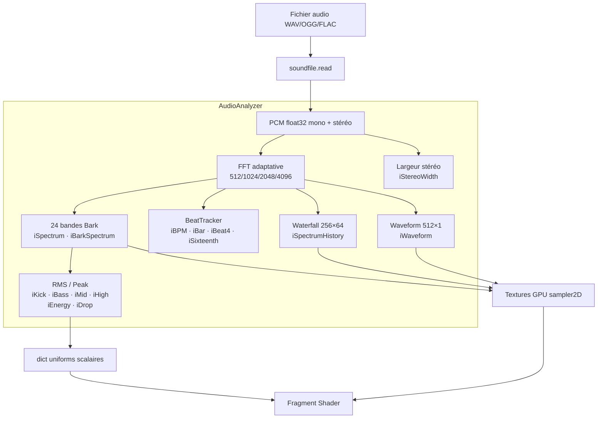
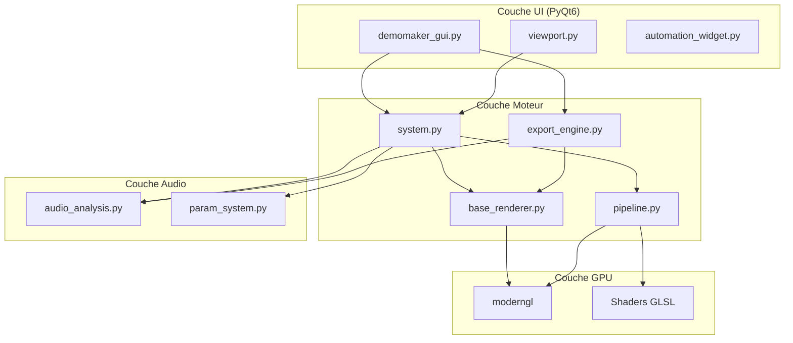

# MEGADEMO — Architecture

> **Version :** Phase 8  
> **Diagrammes :** Mermaid  
> **Mise à jour :** 2025

---

## Vue d'ensemble

MEGADEMO est un moteur de démoscène écrit en Python, articulé autour de :

- un **pipeline de rendu GLSL** configurable par JSON  
- un **analyseur audio réactif** temps-réel et offline  
- une **GUI PyQt6** avec timeline, automation de courbes, éditeur GLSL  
- un **moteur d'export headless** (MP4, ProRes, séquences PNG/EXR)

---

## Arborescence des fichiers

```
megademo/
├── base_renderer.py      ← NOUVEAU Phase 8 : base partagée Engine + ExportEngine
├── system.py             ← Moteur temps-réel (hérite BaseRenderer)
├── export_engine.py      ← Moteur export (hérite BaseRenderer)
├── pipeline.py           ← ScenePipeline, TextureManager, TransitionManager, PostProcessor
├── audio_analysis.py     ← AudioAnalyzer (FFT, BPM, Bark, waterfall)
├── param_system.py       ← ParamSystem, AutomationCurve, LFO
├── demomaker_gui.py      ← Fenêtre principale PyQt6
├── viewport.py           ← Widget OpenGL temps-réel
├── automation_widget.py  ← Éditeur de courbes bézier
├── build_exe.py          ← Empaquetage PyInstaller
├── project.json          ← Données du projet courant
├── scenes/               ← Shaders GLSL par scène  (scene_*.frag, buffer_*.frag)
├── overlays/             ← Shaders d'overlay
├── shaders/              ← Shaders système (intro, transition, post-process)
├── fonts/                ← Polices (fabric-shapes.ttf…)
├── images/               ← Textures d'intro (logo, presents, album)
├── luts/                 ← LUT strips .raw
├── noise/                ← Textures de bruit .raw
├── export/               ← Vidéos exportées
└── tests/                ← Suite pytest
    ├── test_base_renderer.py
    ├── test_audio_analysis.py
    ├── test_export_engine.py
    └── test_project_config.py
```

---

## Hiérarchie des classes (Phase 8)



---

## Pipeline GL par scène



---

## Pipeline Export



---

## Flux de données audio



---

## Couches logicielles



---

## Format `project.json` — champs principaux

| Champ | Type | Description |
|-------|------|-------------|
| `config.RES` | `[int, int]` | Résolution de rendu `[width, height]` |
| `config.MUSIC_FILE` | `string` | Chemin relatif vers l'audio |
| `config.MUSIC_DURATION` | `float` | Durée totale en secondes |
| `config.BPM` | `float` | BPM de référence (override auto-détection) |
| `config.CUE_POINTS` | `float[]` | Cue points manuels → `iCue` |
| `config.automation` | `object` | Données d'automation par scène |
| `timeline[].base_name` | `string` | Nom de la scène (→ `scenes/scene_<name>.frag`) |
| `timeline[].start` | `float` | Début en secondes |
| `timeline[].duration` | `float` | Durée en secondes |
| `timeline[].passes` | `array` | Config passes (optionnel, défaut A/B/C/D) |
| `timeline[].post` | `object` | Post-processing : `bloom`, `grain`, `vignette`, `lut`… |
| `timeline[].transition_in` | `object` | `{effect, duration}` |
| `overlays[].effect` | `string` | Nom du shader overlay |
| `overlays[].file` | `string` | Texture ou `"SCROLL_INTERNAL"` |

---

## Dépendances externes

| Package | Usage |
|---------|-------|
| `moderngl` | Contexte OpenGL, textures, FBO, programmes GLSL |
| `pygame` | Fenêtre OS, mixer audio, chargement d'images (fallback) |
| `numpy` | Calculs DSP, buffers pixel, FFT |
| `soundfile` | Lecture audio PCM (WAV / OGG / FLAC) |
| `PyQt6` | Interface graphique complète |
| `Pillow` *(optionnel)* | Chargement textures PNG dans l'export headless |
| `OpenEXR` *(optionnel)* | Export séquences EXR 32 bits |
| `mido` *(optionnel)* | Réception MIDI live |
| `ffmpeg` *(PATH)* | Encodage vidéo MP4 / H.265 / ProRes / VP9 |

---

## Conventions de nommage des shaders

```
scenes/
  scene_<name>.frag       ← Pass principale
  buffer_a_<name>.frag    ← Pass A (feedback optionnel)
  buffer_b_<name>.frag    ← Pass B
  buffer_c_<name>.frag    ← Pass C
  buffer_d_<name>.frag    ← Pass D
overlays/
  <effect>.frag           ← Shader d'overlay
shaders/
  transition_<name>.frag  ← Transitions (crossfade, glitch_cut, …)
  post.frag               ← Post-processing
  intro.frag              ← Écran d'intro
```

---

## Uniforms système injectés automatiquement

| Uniform | Type | Description |
|---------|------|-------------|
| `iTime` | `float` | Temps global en secondes |
| `iResolution` | `vec2` | Résolution en pixels |
| `iSceneProgress` | `float` | Progression `[0, 1]` dans la scène |
| `iChannel0..3` | `sampler2D` | Textures des passes précédentes |
| `iPrevScene` | `sampler2D` | Dernière frame de la scène précédente |
| `iKick`, `iBass`, `iMid`, `iHigh` | `float` | Énergie audio par bande |
| `iBPM`, `iBar`, `iBeat4` | `float` | Rythme |
| `iSpectrum` | `sampler2D` | Spectre log 256×1 |
| `iBarkSpectrum` | `sampler2D` | 24 bandes Bark |
| `iSpectrumHistory` | `sampler2D` | Waterfall 256×64 |
| `iWaveform` | `sampler2D` | Forme d'onde 512×1 |

---

*Document généré automatiquement par la Phase 8 — Architecture & Performance.*
